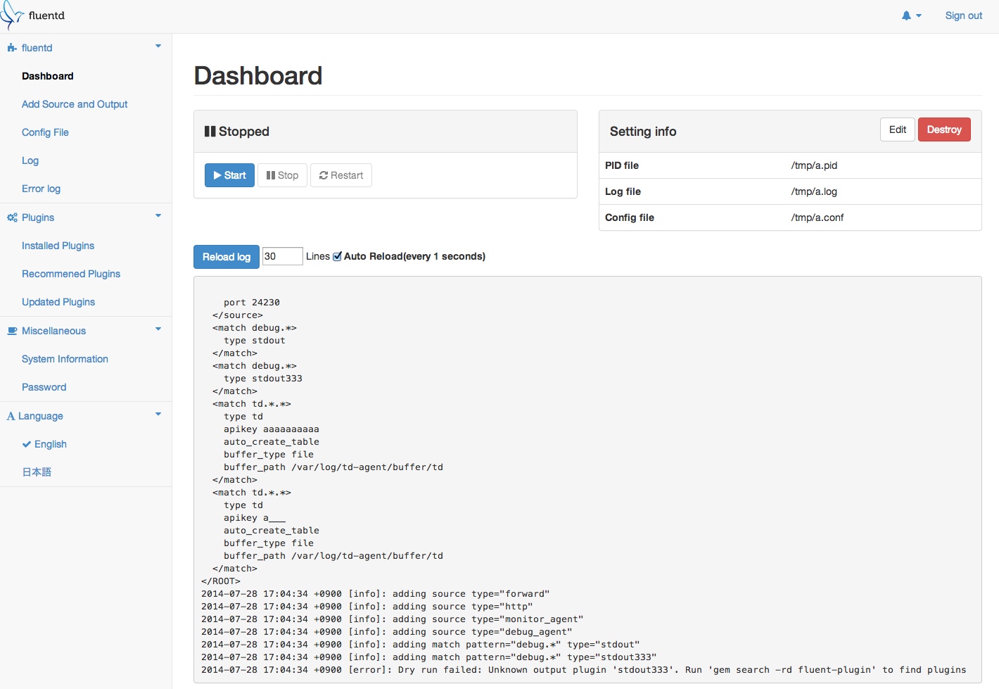
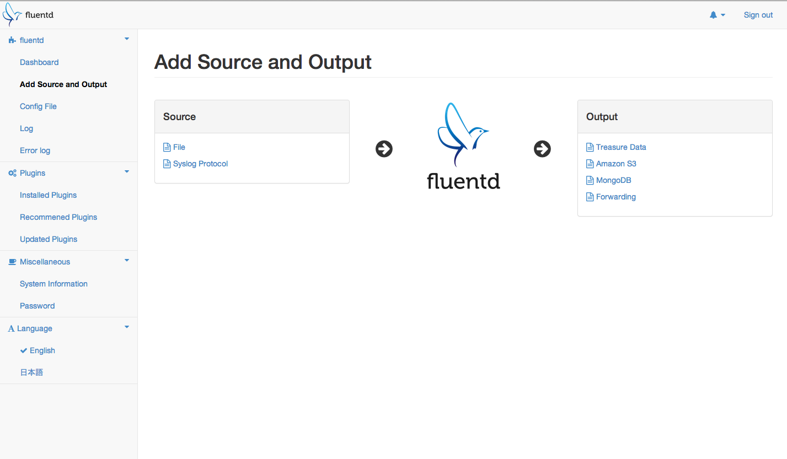
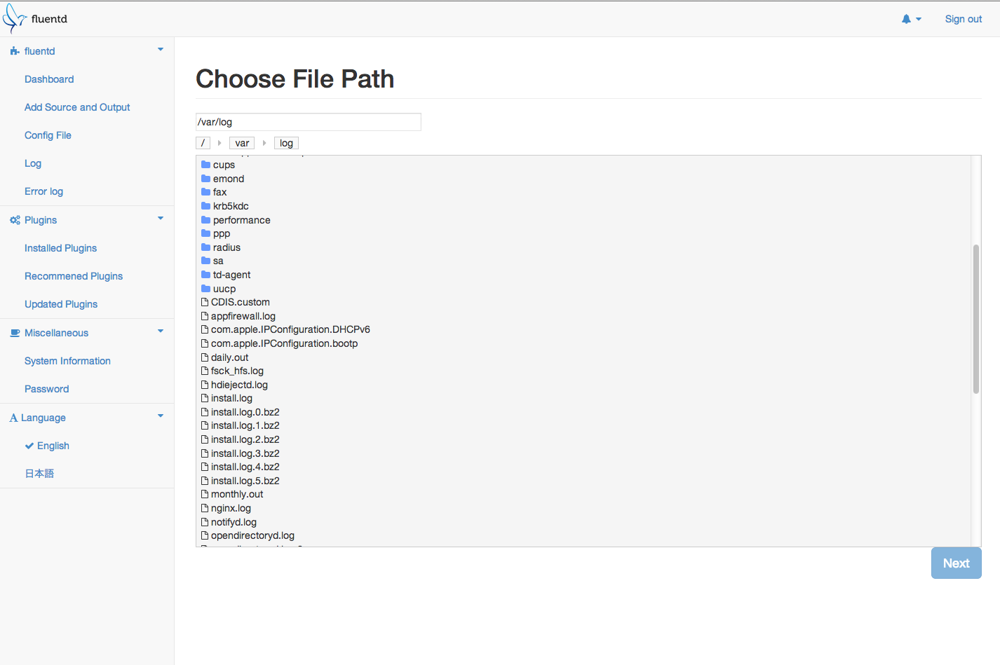
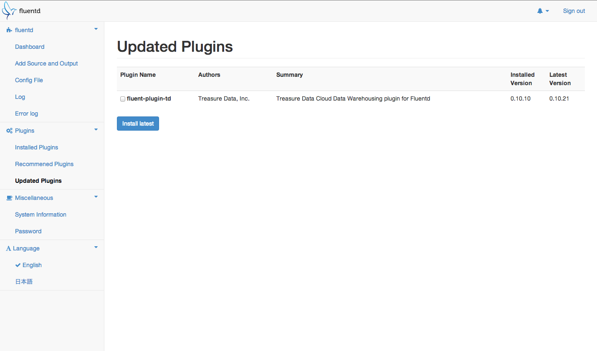

# fluentd-ui

fluentd-ui is a browser-based [fluentd](http://fluentd.org/) and [td-agent](http://docs.treasuredata.com/articles/td-agent) manager that can following operations.

* Install, uninstall, and upgrade fluentd plugins
* start/stop/restart fluentd process
* Configure fluentd setting such as config file content, pidfile path, etc
* View fluentd log with simple error viewer

# Getting Started

```console
$ gem install fluentd-ui
$ fluentd-ui start
Open http://localhost:9292/ by your browser
default account is username="admin" and password="changeme"
```

Or, for developers.

    $ git clone https://github.com/treasure-data/fluentd-ui
    $ cd fluentd-ui
    $ bundle install
    $ bundle exec rails s

# Building fluentd-ui.gem

It has the same tasks of `bundle gem foobar; cd foobar; rake -T`.

    $ bundle exec rake build
    fluentd-ui 0.0.1.pre built to pkg/fluentd-ui-0.0.1.pre.gem.

    $ bundle exec rake release
    # Push to rubygems.org


# Screenshots

(v0.1.0)





