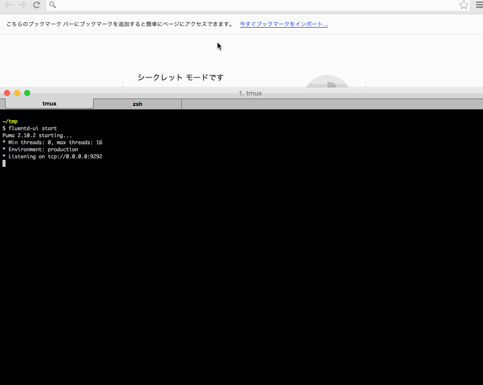
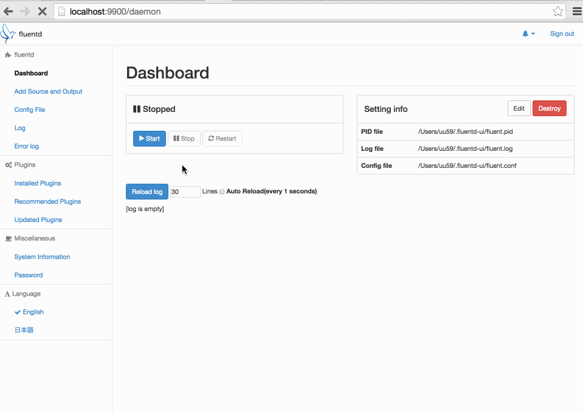
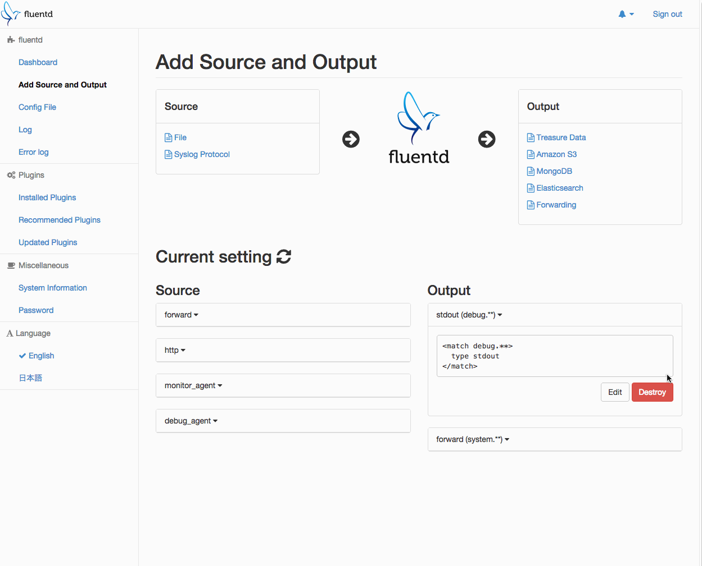
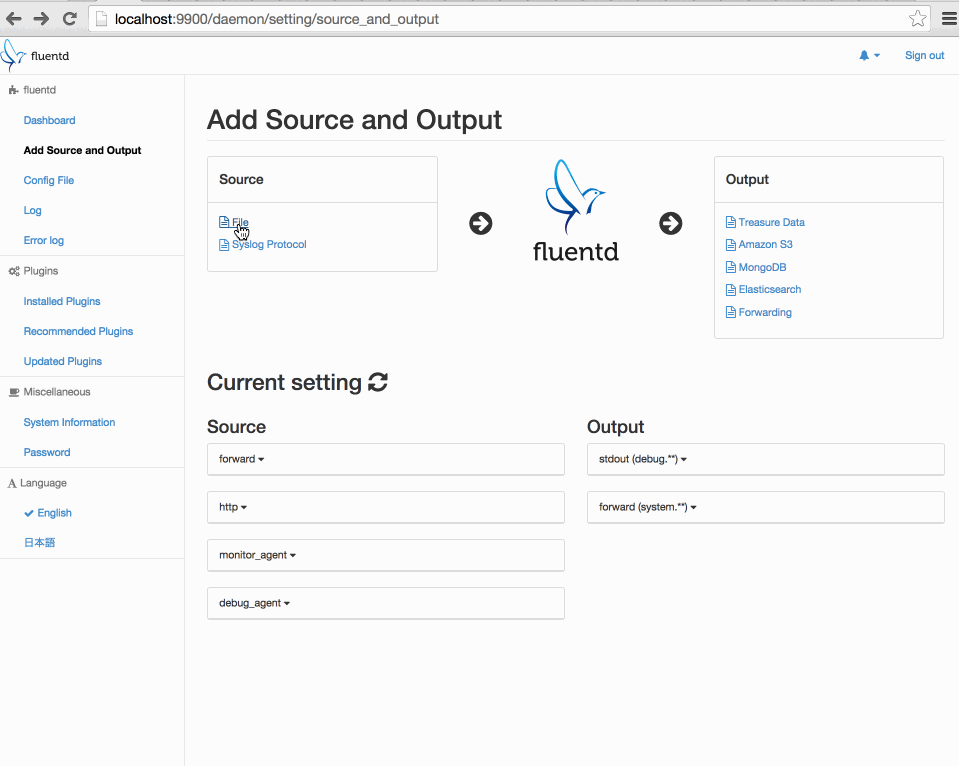
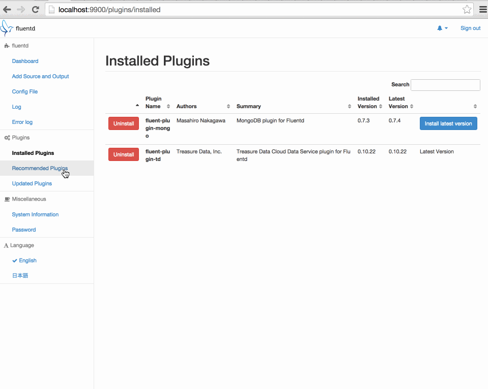
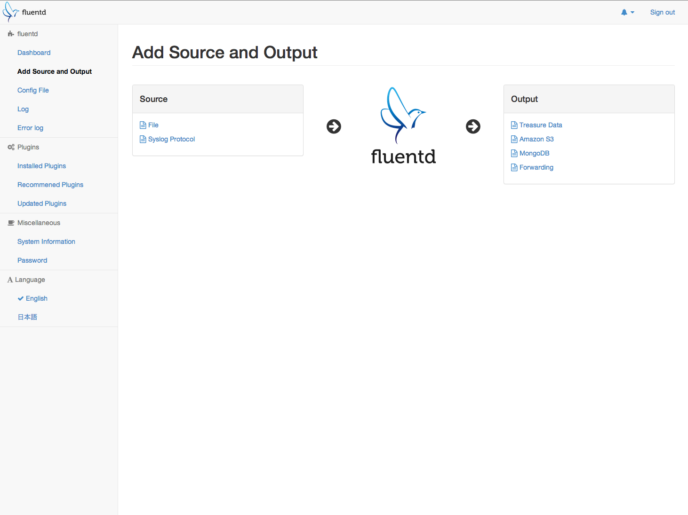
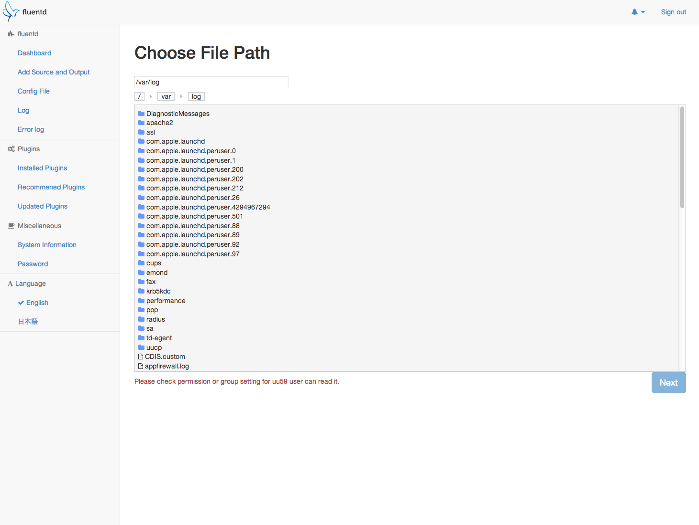
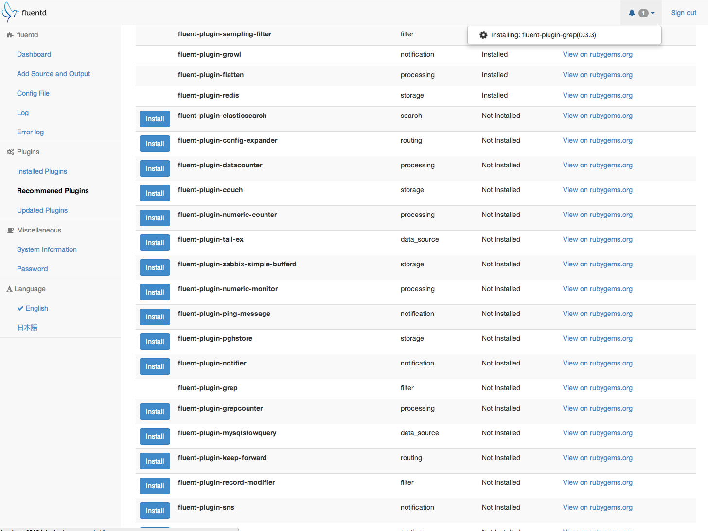

# fluentd-ui

[](https://circleci.com/gh/fluent/fluentd-ui)
[](http://badge.fury.io/rb/fluentd-ui)
[](https://codeclimate.com/github/fluent/fluentd-ui)

fluentd-ui is a browser-based [fluentd](http://fluentd.org/) and [td-agent](http://docs.treasuredata.com/articles/td-agent) manager that supports following operations.

* Install, uninstall, and upgrade Fluentd plugins
* start/stop/restart fluentd process
* Configure Fluentd settings such as config file content, pid file path, etc
* View Fluentd log with simple error viewer


# Getting Started

```console
$ gem install -V fluentd-ui
$ fluentd-ui start
```

Open `http://localhost:9292/` by your browser.<br />
The default account is username="admin" and password="changeme"



## Dependency

- ruby 2.1.3 or later

## To Ubuntu 14.04 user (installed ruby by apt-get)

You also need to install these packages:

- build-essential
- libssl-dev
- ruby-dev

## To the developer

    $ git clone https://github.com/treasure-data/fluentd-ui
    $ cd fluentd-ui
    $ bundle install
    $ bundle exec rails s

Also you need a phantomjs for test.

    $ npm install -g phantomjs
    Or,
    $ brew install phantomjs

NOTE: `phantomjs` executable binary should be located under your `$PATH`.

# Building fluentd-ui.gem

fluentd-ui has the same tasks of `bundle gem foobar; cd foobar; rake -T`.

    $ bundle exec rake build
    fluentd-ui X.X.X built to pkg/fluentd-ui-X.X.X.gem.

    $ bundle exec rake release
    # Push to rubygems.org


# Screenshots

(v0.3.9)

## Dashboard



## Setting



### in_tail setting



## Plugin








